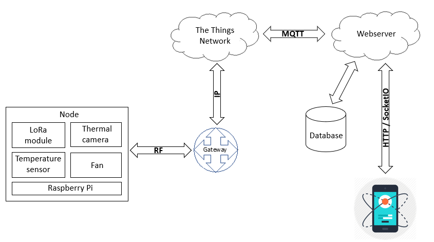

# LoRa based thermal monitoring system for batteries in energy substations

This project was developed for the Wireless Communication Networks course. It aims to acquire, transmit and store data regarding the temperature variation across battery cells (mainly used for photovoltaic systems) in order to check if temperature is within threshold and uniform across all battery cells. 

## Architecture

The overall architecture consists on three main components:

**Node:** acquires data from thermal camera and environment temperature sensor, which is sent to any LoRa public gateway connected to the TTN (The Things Network) server. Later on, the data is forwarded to a webserver through a MQTT broker. It is also responsible for controlling a small fan (simulates a cooling system for the batteries).

**Webserver:** receives and stores data from node in local database. It allows the communication between the node and the mobile app.

**Mobile app:** displays the data acquired from the node (automatically, using websockets) and executes action requested by the user (using HTTP protocol)

On this repo, each component has a separated folder with an individual README.