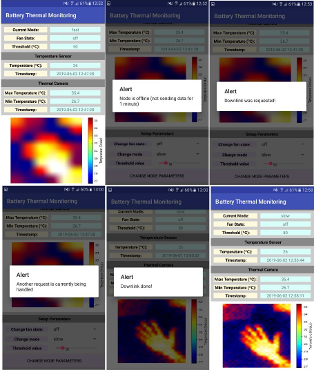

# Mobile application

The mobile app was developed using Android Studio. Instead of uploading all the files used by the IDE, I only uploaded the files that must be changed after creating a new project with the IDE. So, my suggestion is to copy the contents of those files (6 in total) and then create the .apk using the IDE. All the required steps are described on the instructions section.

## Design
The mobile app contains only one activity divided in 4 sections:
1) **Node status:** displays current operation mode, fan state and temperature threshold
2) **Temperature sensor:** displays timestamp and environment temperature of the last reading
3) **Thermal camera:** displays timestamp, max and min temperatures and the image of the last frame received
4) **Setup parameters:** makes request for changing operation mode, fan state and/or temperature threshold
The app also included some alert messages (to inform state of connection to the Internet or the webserver, state of downlink messages, among others)

## Libraries
To make HTTP requests to the webserver, the [Volley library] (https://github.com/google/volley) was used. To subscribe to events associated to SocketIO, the [library from nkzawa](https://github.com/nkzawa/socket.io-android-chat) was used.

## Tests  


## Instructions

1) Clone the repo
```
git clone https://github.com/dgarigali/BatteryThermalMonitoring
```

2) Create a project in Android Studio (tested on version 6)

3) Open the build.gradle file (inside the app folder) and add this two dependencies
```
implementation 'com.github.nkzawa:socket.io-client:0.6.0'
implementation 'com.android.volley:volley:1.1.0'
```

4) Open the AndroidManifest.xml file and add the permission for using internet connection
```
<uses-permission android:name="android.permission.INTERNET" />
```

5) Replace the files string.xml and colors.xml with the ones uploaded in the git repo

6) Replace the files MainActivity.java and activity_main.xml (or the names you chose for the main activity, in case you did not go with the default name) with the ones uploaded in the git repo

7) Go to the .java file and insert the URL (hostname + port) of your webserver on line 41
```
private String url = "http://00.00.00.00:3002";
```

8) Check that there are no errors, create the .apk and transfer it to your android phone. Now, assuming that the webserver is running, you should be able to receive the last data stored in the database after opening the app and to make requests to the node.