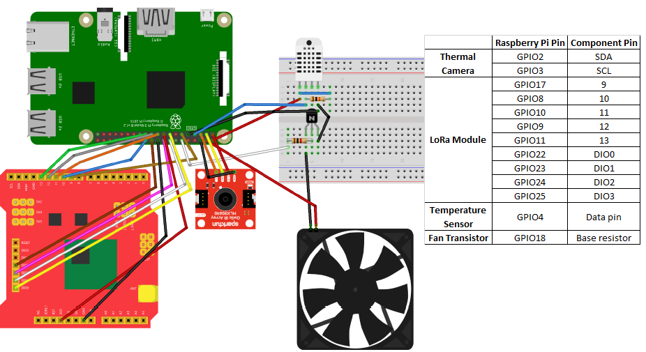

# Raspberry Pi3 based node

The node consists on: temperature sensor, thermal camera, fan, LoRa communication module and Raspberry Pi3 microcontroller. The main script was programmed in Python3. 

## Components 

**Thermal camera:** based on [IR GRID 3 CLICK module](https://www.mikroe.com/ir-grid-3-click) which has a MLX90640 sensor for reading images of 32x24 pixels using the I2C protocol. The python library used consists on [bsdz repo](https://github.com/bsdz/mlx90640-library) which interacts with the [C library developed by melexix](https://github.com/melexis/mlx90640-library).

**Temperature sensor:** [DHT11](https://www.adafruit.com/product/386). The python library was developed by [Adafruit](https://github.com/adafruit/Adafruit_Python_DHT/).

**Fan:** [Raspberry Pi cooling fan](https://www.ptrobotics.com/ventoinhas/6120-5v-cooling-fan-for-raspberry-pi-b-2-and-3.html). Works at 5V/200mA. As max output current from Raspberry Pi is 50mA, you need a small [current amplifier circuit](https://www.raspberrypi.org/forums/viewtopic.php?t=194621). 

**LoRa communication module:** based on [Dragino LoRa Shield](http://wiki.dragino.com/index.php?title=Lora/GPS_Shield) which uses SPI protocol. Python library developed by [jeroennijhof](https://github.com/jeroennijhof/LoRaWAN).

## Connections



## Operation modes
This system was designed in a way it allows 2 transmission modes: **slow** (sends the full image in several messages) and **fast** (sends only higher temperature pixels in fewer messages) taking into account the [limitations when using The Things Network](https://www.thethingsnetwork.org/docs/lorawan/limitations.html).

In the **slow** mode, the full image is sent in 32 messages, taking around 12 minutes to be transmitted (30 seconds between each transmission). In each message, it is sent: one row from the 32x24 image, the environment temperature and the fan state (1 for on, 0 for off). In the **fast** mode, the 32x24 image is reduced to 8x6 (by choosing the max value for each 4x4 block) and it is sent in 2 messages (1 minute) and each message contains four rows from the 8x6 image, besides the environment temperature and fan state.

The selection of the operation mode is initially made directly on the conf.json file and can be later on changed by using the mobile app.

## Instructions

1) Clone the repo
```
git clone https://github.com/dgarigali/BatteryThermalMonitoring
```

2) Setup [your TTN account](https://account.thethingsnetwork.org/users/login), then [add an application](https://www.thethingsnetwork.org/docs/applications/add.html) on the TTN console and finally [register the device](https://www.thethingsnetwork.org/docs/devices/registration.html). Now, you must have associated to your device three things: Device EUI, Application EUI and App Key. **Note: use OTAA as activation procedure**

3) Open main.py, uncomment lines 392-394 and change the 3 parameters based on your device configuration  
```
#deveui = [0x00, 0x00, 0x00, 0x00, 0x00, 0x00, 0x00, 0x00]
#appeui = [0x00, 0x00, 0x00, 0x00, 0x00, 0x00, 0x00, 0x00]
#appkey = [0x00, 0x00, 0x00, 0x00, 0x00, 0x00, 0x00, 0x00, 0x00, 0x00, 0x00, 0x00, 0x00, 0x00, 0x00, 0x00]
```

4) Check the parameters defined on conf.json. By default, the fan is off, the operation mode is **fast** and the temperature threshold (that activates fan if battery max temperature is above that value) is 50ºC.

5) Install adafruit python library
```
sudo pip3 install Adafruit_DHT
```

6) Connect the hardware following the schema above

7) Run python main script
```
python3 main.py
```

Now, the program must be reading data from sensors and sending it to the closest TTN gateway according to the operation mode selected, besides from checking any received message after each transmission (device works as class A). The script prints some messages for debugging such as informing that device found a TTN gateway nearby and that a message was sent or receive.  
