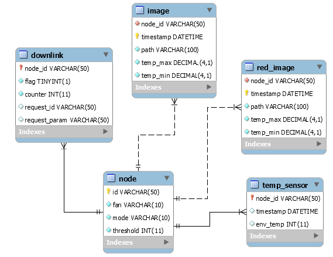

# Flask based webserver

The webserver ensures the bidirectional communication between the node and the mobile app. It receives the messages from the node, creates the image using some Python-specific libraries (mentioned furthermore) after collecting the 32 messages (**slow mode**) or the 2 messages (**fast mode**) and sends it to the mobile app using websockets, alongside the environment temperature and the fan state. It receives a HTTP request every time the user performs any action on the mobile app (for instance, changing the temperature threshold), sending that request back to the node.

## Requirements

You must have a Linux-based hosting server with Python3 and a MySQL server installed. Flask is a python based web application framework. To [deploy it on a hosting server](https://flask-socketio.readthedocs.io/en/latest/#deployment), you must run it using the gunicorn webserver with the eventlet worker (in order to allow the use of websockets). All the required steps are described on the instructions section.

## Database schema

Storing the images collected, alongside the status of the node's components, the environment temperature and the downlink messages (from LoRa communication) into a local MySQL based database ensures some redundancy to the application. The content of each table of this simple schema should be self-explanatory.



## REST API

The following table shows the routes of the REST API developed for the communication between the webserver and the mobile app

|Method |    Path    |                                    Arguments                                   |              Description                |
|:------|:-----------|:-------------------------------------------------------------------------------|:----------------------------------------|
| POST  | /downlink  |                                 { msg : [string] }                             |         Checks sucessfull downlink      |
| POST  | /fan       |                                 { fan : [string] }                             |         Updates fan state               |
| POST  | /mode      |                                 { mode : [string] }                            |         Updates operation mode          |
| POST  | /threshold |                                { threshold : [int] }                           |         Updates temp. threshold         |
| POST  | /image     | { timestamp : [string], temp_min : [float], temp_max : [float], image : [][] } |   Updates image, time and temperatures  |
| POST  | /env_temp  |                         { timestamp : [string], temp : [int] }                 |     Updates time and env. temperature   |
| POST  | /request   |                          { success : [bool], msg : [string] }                  |           Sends downlink request        |

## Instructions

1) Clone the repo
```
git clone https://github.com/dgarigali/BatteryThermalMonitoring
```

2) Go to the [TTN console](https://console.thethingsnetwork.org/), enter in the application previously created, check its ID (APPLICATION EUI) and create (on the same page) an access key. Then, open the conf.json file and insert the values for the app_id and access_key fields. This allows that the data sent to any TTN gateway by any device registered in that application is forwaded to the webserver.

3) Install the [python library](https://www.thethingsnetwork.org/docs/applications/python/) for receiving forwaded data from TTN gateway
```
pip3 install ttn
```

4) Create database on MySQL server using the db.sql file

5) Open the credentials.json file and insert the user and password of the MySQL server

6) Install library for querying database from python script
```
apt-get install python3-pymysql
```

7) Install python libraries for creating images from temperature pixels
```
pip3 install Pillow
apt-get install python3-matplotlib
```

8) Install flask framework and flask-socketio (for websockets)
```
pip3 install flask flask-socketio
```

9) Install gunicorn webserver and eventlet worker
```
pip3 install gunicorn eventlet
```

10) Deploy the webserver on gunicorn (as a brackground task)
```
gunicorn -b 0.0.0.0:3002 --worker-class eventlet app:app
```

**NOTE:** Port 3002 from Linux-based server must be open!

Now, the webserver should be ready to: receive forwarded data from any TTN gateway regarding the registered device; send data through websockets to topics (later on displayed on the mobile app) and receive requests from the mobile app, forwading it to the node.